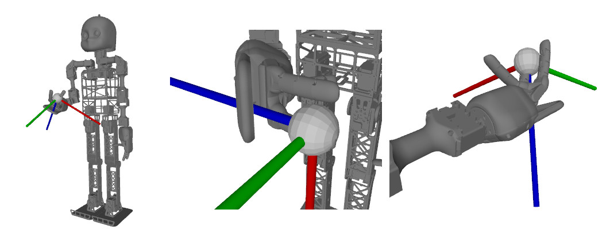
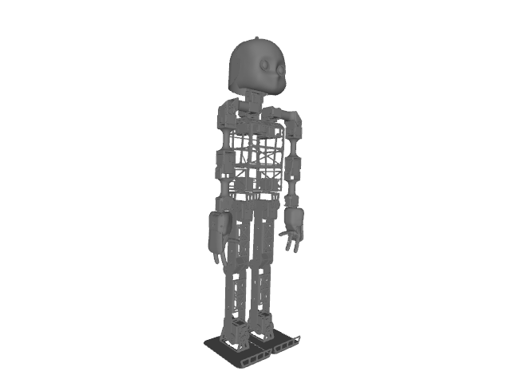

# Introduction

gaikpy solves the inverse kinematics for every URDF based robot model using a genetic algorithm approach. No pretraining is needed. gaikpy is completely realised in python. gaikpy has already integrated the [NICO robot](https://www.inf.uni-hamburg.de/en/inst/ab/wtm/research/neurobotics/nico.html), but you can easily extend this with every robot with a URDF model at hand. Just take the URDF and define your chain ( containing the joints you want to use) , calculate the ik and maybe visualize it. 

If you use the library in an academic context, you can cite it by citing the paper below. We analysed the ik in a hybrid manipulation context for the NICO robot ( the measured calculation times in the paper are already outdated, gaikpy is much faster now ).

Neuro-Genetic Visuomotor Architecture for Robotic Grasping   
Matthias Kerzel, Josua Spisak, Erik Strahl, Stefan Wermter
Artificial Neural Networks and Machine Learning – ICANN 2020, pages 533-545 - 2020.

https://www2.informatik.uni-hamburg.de/wtm/publications/2020/KSSW20/ICANN_2020__Neuro_Genetic_Visuomotor_Framework_Preprint.pdf

# History and credits

The Neuro Inspired COmpanion ( or [NICO](https://www.inf.uni-hamburg.de/en/inst/ab/wtm/research/neurobotics/nico.html) ) is the robot we developed at the [Knowledge Technology group](https://www.inf.uni-hamburg.de/en/inst/ab/wtm/about.html) at the [University of Hamburg](https://www.uni-hamburg.de/en.html) to fullfill our [reasearch needs](https://www2.informatik.uni-hamburg.de/wtm/publications/2017/KSMNHW17/NICO_RO-MAN_2017-PREPRINT-2017.pdf). Our philosophy is to have a full python based interface for the NICO ( besides our ROS based interface ), so we searched for a python based ik library. We found [ikpy](https://github.com/Phylliade/ikpy), which is a great software, but was at least at time we started not able to solve the full-pose ik ( but only the position ) for our NICO robot. So we started with the genetic ik approach one of our [former students developed](https://ieeexplore.ieee.org/document/7866587), but unfortunately not in python, but in c#.

# Installation

+ Clone the repository with git clone 
+ Change to the directory - "cd gaikpy"
+ Create a python environment - "python3 -m venv env"
+ Source your environment - "source ./env/bin/activate"
+ Install - "python setup.py develop" or "python setup.py install"
+ Run the test - "python setup.py test"
You should have no errors ( warnings are fine, the included libraries might throw some)

# Usage

Use the gaikpy to solve the full pose ik for you. 
See the example at ./examples/visualise_NICO.py . It will solve the ik of the NICO robot and visualise the results on the screen. Extend the example for your own needs.

# Integrate another robot

# License

GNU GENERAL PUBLIC LICENSE Version 3